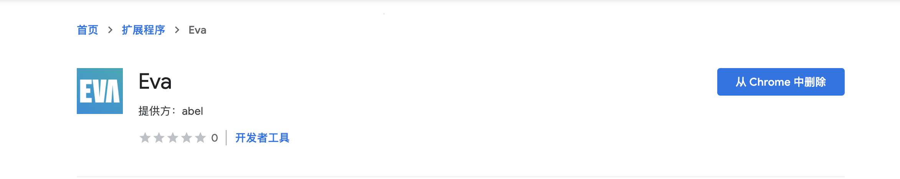
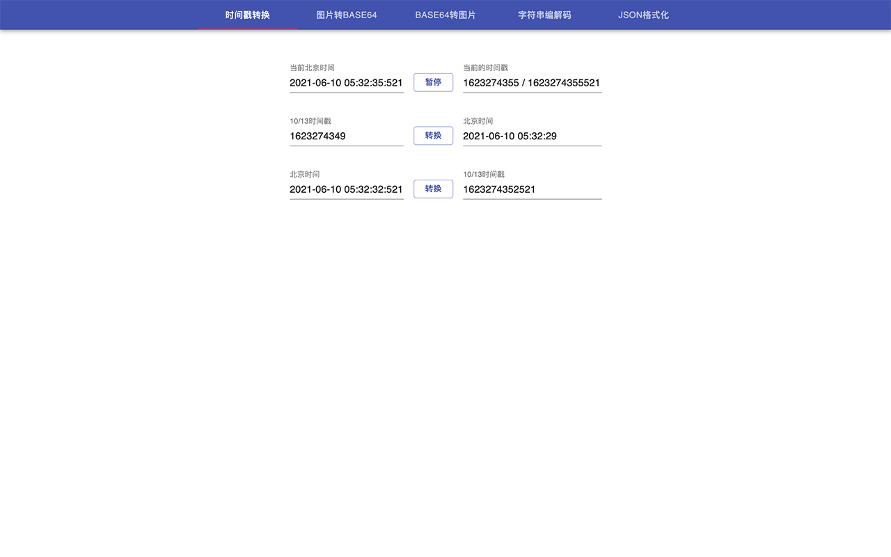
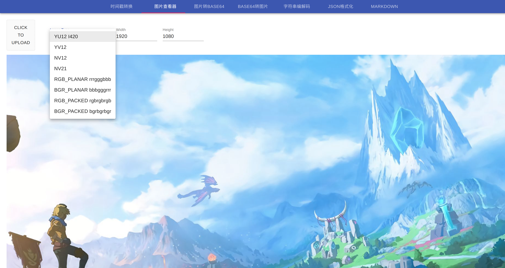
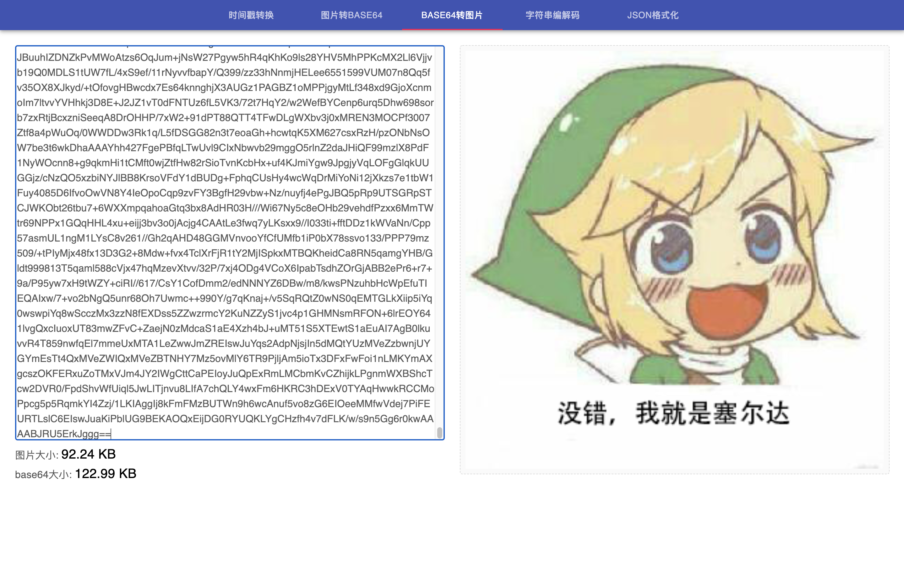
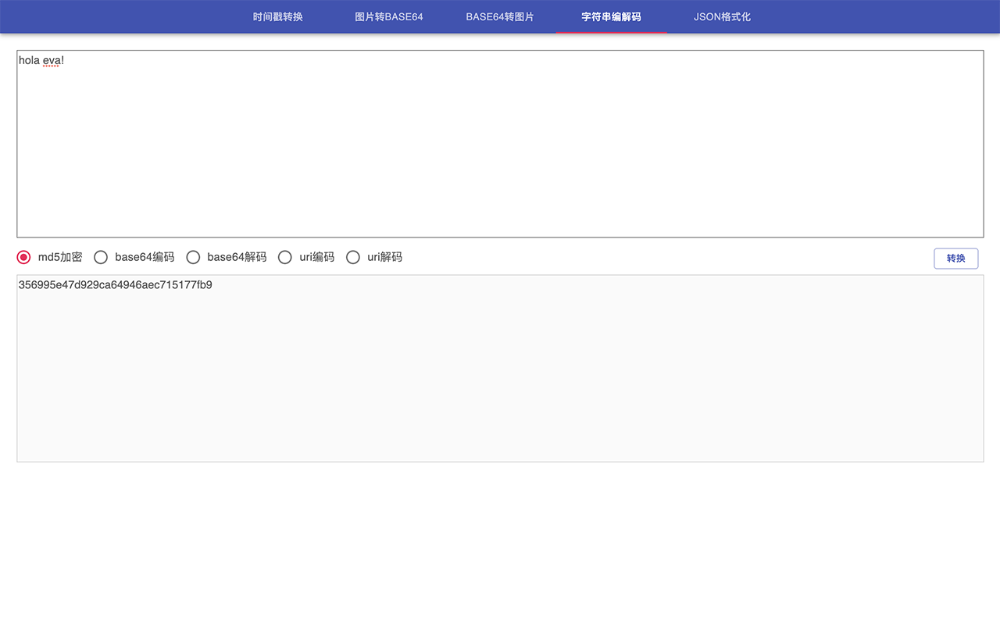
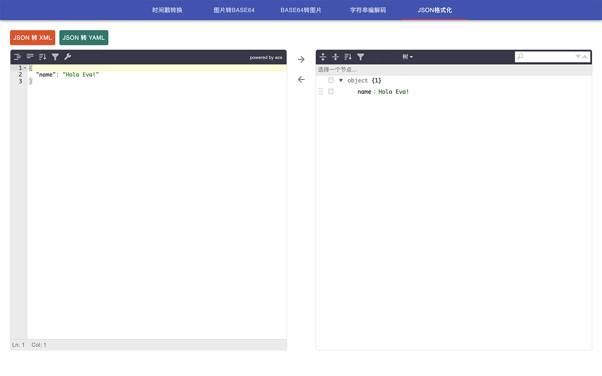
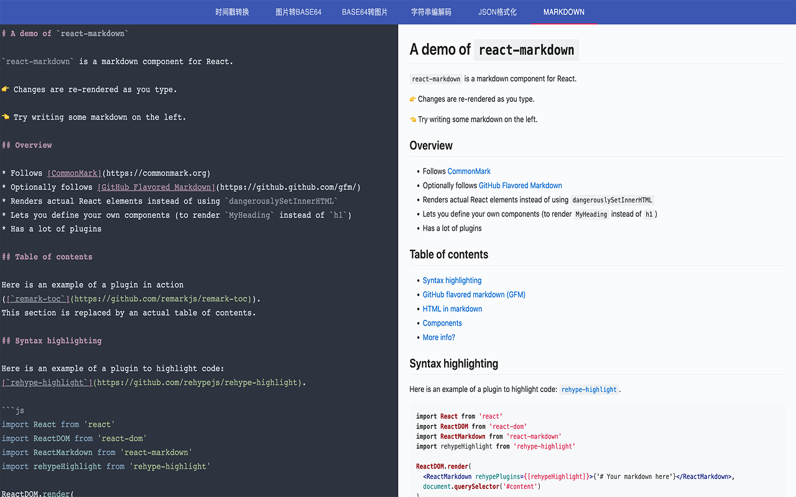

# [EVA](https://github.com/abelleeye/eva)
一款因作者需求而生的一款极简风谷歌扩展!

[扩展商店地址](https://chrome.google.com/webstore/detail/eva/dcjhacinagjbejleicefnpcnbeffhihi)

# logo作者
Peter Qian(钱学毅)

# 功能

- 时间戳转换
- 图片查看器 YUV RGB etc
- 图片转base64
- base64转图片
- 字符串编解码(md5, base64, uri)
- JSON格式化(json format, json to xml, json to yaml)
- 在线编写Markdown
  
# 使用方法
直接点击扩展图标会弹出主页面

# 页面截图

# 离线安装方法

## 自行编译
1. `yarn` 安装依赖
2. `yarn build` 将编译好的 `dist` 文件夹拖拽进谷歌浏览器中。

## 下载RELEASE
下载RELEASE最新版本
解压缩dist.tar
将解压缩的 `dist` 文件夹拖拽到chrome扩展页面
